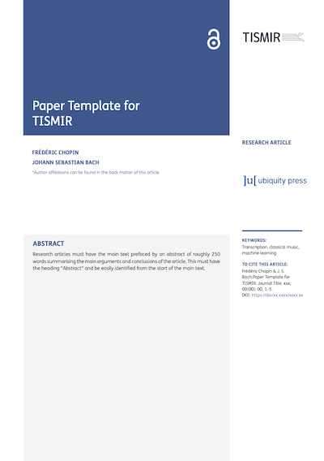

# TISMIR Paper Template (New Version)

This repository contains the most recent template for the Transactions of the International Society for Music Information Retrieval (https://transactions.ismir.net/). The goal was to have a template which is closer to the published format.

If you are looking for a more lightweight version, consider using the [old version](https://github.com/ismir/paper_templates_TISMIR_old) (including a Microsoft Word option). Both versions are accepted for publication.

## Template Overview

## How to Contribute

We welcome contributions! Please feel free to:
- Open an issue to report bugs or suggest improvements
- Submit a pull request with your changes

## Known Issues

## License

This template is licensed under the [Creative Commons Attribution 4.0 International (CC BY 4.0)](https://creativecommons.org/licenses/by/4.0/) license.
